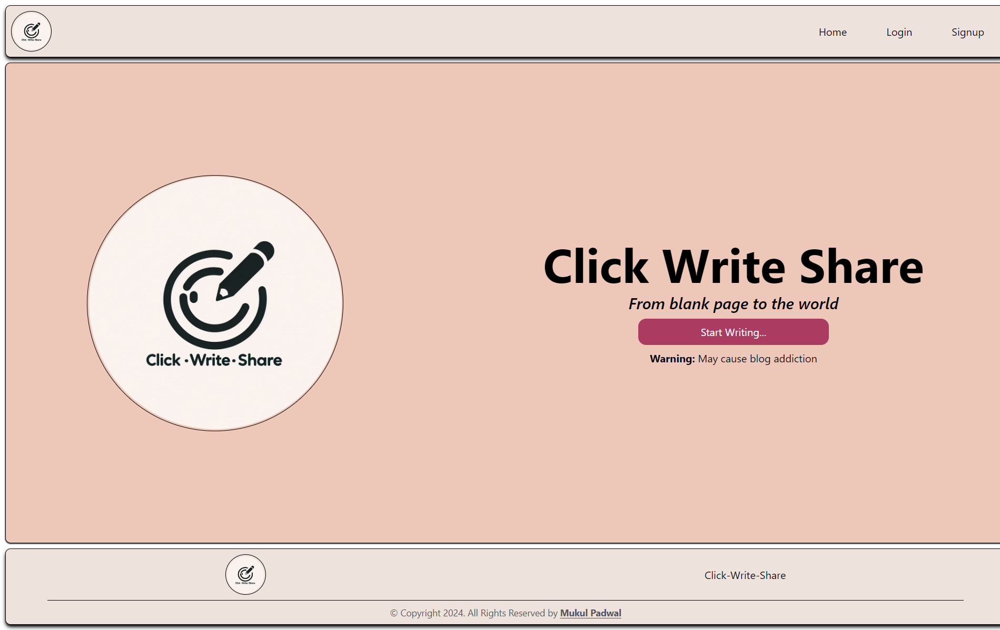

# Click Write Share (From blank page to the world)

## **Warning:** May cause blog addiction

<p align="center" >
    </img>
</p>

*Welcome to Click Write Share, a modern blogging platform designed to make writing, sharing, and managing your content effortless. Built with React, Vite, and styled with Tailwind CSS, this web application offers a sleek and responsive interface. With real-time toast notifications and robust backend support from Appwrite, Click Write Share is your go-to tool for effective blogging and content management.*

## Features
- User-Friendly Blogging: Create, edit, and publish your blog posts with ease.
- Responsive Design: Enjoy a seamless experience across all devices, thanks to Tailwind CSS.
- Backend as a Service: Leverage Appwrite for secure and scalable backend support.

## Getting Started
To set up Click Write Share on your local machine, follow these steps:

###  Prerequisites
Ensure you have the following installed:
- Node.js (v18 or later)
- Vite
- Appwrite account and backend setup

### Clone the Repository
```
git clone https://github.com/your-username/click-write-share.git
cd click-write-share
```

### Install Dependencies
```
npm install
```

### Configure Environment Variables
Rename the .env.example file to .env and update the values with your Appwrite project credentials and other necessary configurations.

### Run the Development Server
```
npm run dev
```

## Built With
- React - A JavaScript library for building user interfaces
- Vite - A fast build tool for modern web projects
- Tailwind CSS - A utility-first CSS framework
- react-hot-toast - A library for displaying toast messages
- Appwrite - Backend-as-a-Service for app management

## Contributing
We welcome contributions to Click Write Share! To contribute:
- Fork the Repository: Create your own fork on GitHub.
- Create a Branch: Make a new branch for your changes.
- Make Your Changes: Implement your enhancements or fixes.
- Submit a Pull Request: Share your changes with us via a pull request.